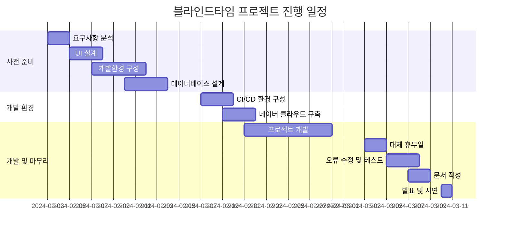

# 블라인드타임 - 데이팅 앱 프로젝트

  

**랜덤 유저와 실시간으로 연결되는 데이팅 앱 서비스**

## 📢 프로젝트 소개

> **코로나 이후 사람과 사람이 만나기 어려워진 현대인들을 위한 데이팅 앱 서비스**

- **차별성**: 가입 조건 없는 높은 접근성, 제한된 시간과 채팅, 랜덤 매칭 등 재미 요소 추가
- **필요성**: 간편한 이성 매칭 서비스 제공을 통한 사회적 문제(저출산 등) 해결에 기여
- **특징**: 사용자 친화적 인터페이스와 강력한 관리자 시스템 구축

## ✨ 서비스 링크

| 서비스 | 링크 |
|:---:|:---|
| **사용자 앱** | [https://blindtime.kro.kr/](https://blindtime.kro.kr/) |
| **관리자 페이지** | [http://admin.blindtime.kro.kr/](http://admin.blindtime.kro.kr/) |
| **프로젝트 제안서** | [데이팅 앱 (블라인드, 랜덤 채팅).pdf](https://github.com/user-attachments/files/19158560/default.pdf) |
| **프로젝트 보고서** | [Canva 링크](https://www.canva.com/design/DAGhTqV58Ps/0lGyzc8-rDttqzwHqTN8mw/edit) |

## 💻 팀 구성원

| 🐻‍❄️ 김정현 (팀장) | 🦝 배태선 (부팀장) | 🐔 김주영 | 🦅 조연식 | 🐻 황하성 |
|:---:|:---:|:---:|:---:|:---:|
|  |  |  |  |  |
| [GitHub](https://github.com/kjh1125) | [GitHub](https://github.com/C4T4767) | [GitHub](https://github.com/JUYOUNG34) | [GitHub](https://github.com/dustlr7193) | [GitHub](https://github.com/HwangHaseong) |

### 역할 분담

| 팀원 | 담당 업무 |
|:---|:---|
| **김정현** | - 전체 일정 관리 - CI/CD 및 Cloud 서버 - 사용자 앱 개발(자유게시판) |
| **배태선** | - 사용자 앱 개발(회원가입, 로그인, 메인화면, 채팅, 마이페이지) |
| **김주영** | - 관리자 웹 개발 일정 관리 - 관리자 Cloud 서버 - 관리자 개발(시큐리티, 통계, 이벤트) |
| **조연식** | - 관리자 개발(사용자, 관리자, 로그, 게시판) |
| **황하성** | - 관리자 개발(공지사항, 신고) |

## 🔧 기술 스택

### Backend

### Frontend

### Realtime Communication

### Authentication

### Infrastructure

### Database

### Collaboration

## 📅 프로젝트 일정

- **총 기간**: 2024.02.03(월) ~ 2024.03.10(월) (5주)
- **실제 작업 기간**: 17일
- **투입 인원**: 5명

### 주요 마일스톤

- ✅ **2월 04일**: 요구사항 분석 완료
- ✅ **2월 13일**: 데이터베이스 및 개발환경 구성 완료
- ✅ **2월 21일**: CI/CD 환경 및 클라우드 설정 완료
- ✅ **2월 28일**: 프로젝트 개발 완료
- ✅ **3월 07일**: 테스트 및 오류 수정 완료
- ✅ **3월 10일**: 최종 발표 및 시연

### 상세 일정

| 주차 | 기간 | 작업 내용 |
|:---:|:---|:---|
| **1주차** | 2024.02.03 ~ 2024.02.04 | 요구사항 분석 |
| | 2024.02.05 ~ 2024.02.07 | UI 설계 |
| | 2024.02.07 ~ 2024.02.11 | 개발환경 구성 |
| | 2024.02.10 ~ 2024.02.13 | 데이터베이스 설계 |
| **2주차** | 2024.02.17 ~ 2024.02.19 | CI/CD 환경 구성 |
| | 2024.02.19 ~ 2024.02.21 | 네이버 클라우드 구축 |
| | 2024.02.21 ~ 2024.02.28 | 프로젝트 개발 |
| **3주차** | 2024.03.03 ~ 2024.03.04 | 대체 휴무일 |
| | 2024.03.05 ~ 2024.03.07 | 오류 수정 및 테스트 |
| | 2024.03.07 ~ 2024.03.08 | 문서 작성 |
| | 2024.03.10 | 발표 및 시연 |

## 📊 프로젝트 일정 간트 차트

© 2025 블라인드타임 팀. 모든 권리 보유.
